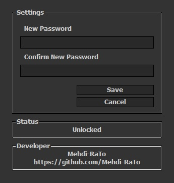

# 🖥️ Desktop Locker

**Desktop Locker** is a lightweight and user-friendly tool that instantly locks your desktop screen. It helps protect your privacy and prevent unauthorized access when you're away from your computer.

## 🔐 Features

- Clean and minimal user interface
- Lock your desktop with a single click
- Portable — no installation required
- Free for personal use

## 📥 Download

🔗 Get the latest version from the link below:
[Download Latest Version](https://github.com/Mehdi-RaTo/DesktopLocker/releases/latest)

## 🎥 Demo

## ⚠️ Disclaimer

This software is intended for **personal and ethical use only**.
Any **malicious, illegal, or unethical use is strictly prohibited**, and the developer holds **no responsibility** for any misuse or resulting consequences.
Please use this tool responsibly and in accordance with your local laws.

## 📄 License

This software is proprietary and distributed for **personal and non-commercial use only**.

You are **not allowed** to:
- Modify, reverse-engineer, or redistribute the software.
- Use it for any commercial or unlawful activity.

By using this software, you agree to these terms.
See the [LICENSE](./LICENSE) file for full details.

> Developed by [Mehdi-RaTo](https://github.com/Mehdi-RaTo)